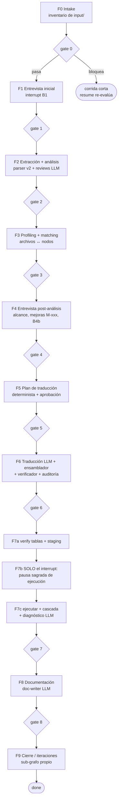
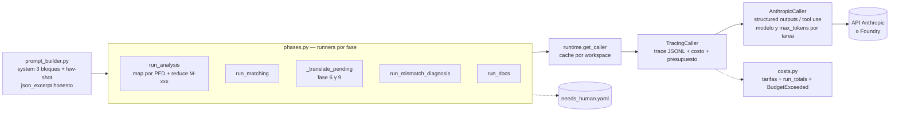
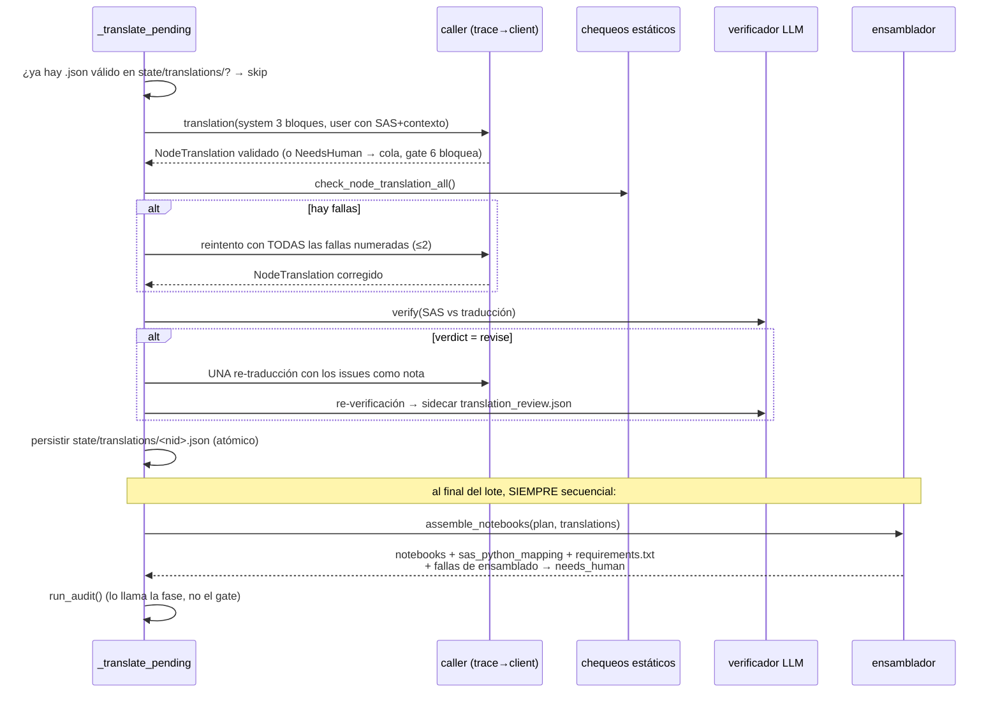

# Arquitectura de sas-migrator v2 — de lo general a cada archivo

> Documento exhaustivo de cómo funciona el agente: la idea, la orquestación
> LangGraph, el núcleo determinista archivo por archivo, y la capa LLM.
> Complementa `COMO-FUNCIONA.md` (guía de operación) y los ADRs de `docs/adr/`.

---

## 1. Qué es

`sas-migrator` migra proyectos de **SAS Enterprise Guide** (`.egp`) a
**Python/pandas + T-SQL** en notebooks Jupyter, con un humano en el loop en
los puntos de decisión. Toma un `.egp`, lo desarma en nodos de código SAS,
entrevista al usuario sobre lo que el código no dice (conexiones, alcance,
mejoras), traduce nodo por nodo con un LLM, ensambla notebooks deterministas,
los audita, los ejecuta contra una BD (solo con autorización explícita) y
valida las salidas contra el ground truth de SAS.

## 2. Principios de diseño (las invariantes)

Todo el sistema se sostiene sobre seis reglas; cada una tiene tests que la
vigilan y un ADR que la explica:

1. **El LLM nunca escribe artefactos.** Produce objetos Pydantic validados
   (`NodeTranslation`, `PfdAnalysisOut`, …); los archivos los escribe código
   determinista (el ensamblador, los runners, el runtime del grafo).
2. **Avanzar sin pasar el gate es imposible por topología.** Los gates son
   nodos del grafo con edges condicionales; no hay camino alternativo
   (ADR-0001). Y los gates son **predicados puros**: leen artefactos, jamás
   los producen.
3. **Nunca silencio.** Trabajo LLM que no produjo output utilizable queda en
   la cola `state/needs_human.yaml` y el gate de su fase bloquea hasta que un
   humano lo resuelva. Un hueco en el código generado es un
   `raise NotImplementedError(...)`, nunca un valor vacío que fluye.
4. **Determinismo byte a byte.** Dos corridas stub sobre el mismo workspace
   producen artefactos idénticos (módulo timestamps). Cell ids fijos por
   posición, escritores atómicos con formato pineado, orden de ensamblado por
   plan.
5. **Frontera `core/`.** `core/` no importa `langgraph`, `anthropic`, `graph/`
   ni `llm/` — hay un test de arquitectura que lo impide. Todo lo determinista
   es testeable sin API key.
6. **Lo específico del cliente vive en config.** `project_config.yaml`
   (estricto: clave desconocida = error con nombre) y `.env` para credenciales.
   El código no trae defaults de infraestructura ajena.

## 3. El workspace

Cada migración vive en un directorio propio:

```
mi_migracion/
├── project_config.yaml    # config del proyecto (estricta; ver §12)
├── .env                   # credenciales (nunca se commitea)
├── input/
│   ├── egp/proyecto.egp   # el proyecto EG a migrar (exactamente uno)
│   ├── data/*.csv|xlsx    # salidas SAS de referencia (ground truth fase 7)
│   └── docs/              # documentación de negocio opcional
├── state/                 # TODOS los artefactos intermedios (auditable)
│   ├── checkpoint.sqlite  # checkpointer LangGraph (reanudación)
│   ├── nodes/*.json       # un JSON por nodo SAS extraído
│   ├── translations/*.json# una NodeTranslation persistida por nodo
│   ├── needs_human.yaml   # la cola de trabajo humano pendiente
│   ├── llm_trace.jsonl    # cada llamada LLM: tokens, costo, outcome
│   └── … (índices, plan, auditoría, reportes; ver §6)
└── output/
    ├── NB-XX_flujo.ipynb  # notebooks generados (uno por Process Flow)
    ├── requirements.txt   # el entorno destino real de los notebooks
    ├── run_all.py         # orquestador de ejecución
    └── docs/*.md          # README, LINEAGE, DECISIONS, IMPROVEMENTS, RUNBOOK
```

## 4. Las 10 fases y sus gates



| Fase | Hace | Gate exige (entre otras cosas) |
|---|---|---|
| 0 Intake | Inventario de `input/` → `intake.json` | intake válido |
| 1 Entrevista inicial | Tarjeta B1 (`interrupt()`): estrategia de salida, contexto | respuestas aplicadas |
| 2 Análisis | Extractor `.egp` → `nodes/*.json`; parser v2 (placement, lineage); índices; reviews + fichas M-xxx (LLM) | índices/reviews presentes; sin needs_human fase 2 |
| 3 Profiling | Perfila `input/data/`; matching archivo↔nodo (LLM) | `file_mapping.json` válido; sin needs_human |
| 4 Entrevista post | Alcance (nodos nativos uno a uno), mejoras M-xxx una a la vez, B4b (placement por causa raíz → `db_connections.yaml` + `placement_decisions.yaml`) | decisiones completas |
| 5 Plan | `planning.build()` determinista → `translation_plan.json`; aprobación (`interrupt()`) | `user_approved: true` |
| 6 Generación | Traducción por nodo (LLM) → chequeos estáticos → verificador LLM → ensamblador → `run_audit()` | mapping completo, audit sin high bloqueantes, sin needs_human |
| 7 Validación | verify tablas → **pausa sagrada** → ejecución nbclient (skip idempotente por hash) → cascada vs referencias → diagnóstico LLM de mismatches | reporte sin FAIL full / blocked |
| 8 Docs | doc-writer LLM → 5 documentos en `output/docs/` | docs con sustancia; sin needs_human |
| 9 Post-migración | `finish` + ciclos `iterate` (sub-grafo con checkpointer propio) | `IterationEntry` cerrada con validación re-corrida |

## 5. La orquestación LangGraph

### 5.1 Topología (`graph/builder.py`)

`PHASES` es la lista ordenada `(nombre_de_nodo, función, fase_del_gate)`. Una
fila con fase `None` es un **sub-nodo** que se encadena directo al siguiente
(la fase 7 son tres: `phase7_verify` → `phase7_authorize` →
`phase7_execute_validate`, ADR-0009). Entre cada fase y la siguiente el
builder inserta un **nodo gate** que llama a `check_gate(fase, state_dir)`
(`core/utils/schema_validation.py`) y enruta con un edge condicional:
`pasa → fase siguiente`, `bloquea → END`. En cada gate el runtime **proyecta**
`migration_state.json` a disco (modelo Pydantic `MigrationState`, con
`tokens_consumed` poblado desde el trace) — en v1 ese JSON lo redactaba un LLM
a mano.

### 5.2 Estado del grafo (`graph/state.py`)

`MigrationGraphState` (TypedDict) es **control de flujo, no contenido**:
workspace, egp_file, fase actual, `last_gate`, `gate_history` (append-only por
reducer), `stub_mode`, `notes`, `execution_authorized` (la decisión de la
pausa sagrada viaja por acá — es exactamente lo que el checkpointer sabe
rebobinar). El contenido vive en `state/` en disco.

### 5.3 Checkpointer, interrupts, reanudación

- **Checkpointer**: `SqliteSaver` sobre `state/checkpoint.sqlite`. Cada nodo
  ejecutado es una frontera de checkpoint. Matar el proceso en cualquier punto
  y `resume` continúa sin repetir ni saltar gates.
- **Entrevistas** (`graph/interviews.py`): cada pregunta es un `interrupt()`
  con payload tipado (`InterviewCard`); la respuesta vuelve por
  `Command(resume=CardAnswers)`. `ask()` re-valida al reanudar: una respuesta
  inválida re-interrumpe con `validation_error`, nunca crashea (ADR-0002/0003).
  Por ADR-0002 un nodo con interrupt se re-ejecuta completo al reanudar — por
  eso `phase7_authorize` contiene SOLO el interrupt, sin efectos.
- **`resume`**: si la corrida terminó en gate bloqueado, delega en
  `MigrationSession.retry_gate()` — un fork del checkpoint pre-gate que
  re-evalúa el predicado sin re-correr la fase.
- **`rewind --phase N`**: rehace una fase descartando los checkpoints
  posteriores (fork del checkpoint anterior a la fase).
- **Fase 9**: cada ciclo de iteración corre en su propio thread
  (`iteration-NNN`) del MISMO sqlite; `IterationEntry` se upserta por ciclo;
  las `in_progress` colgadas pasan a `deferred` visibles al arrancar un ciclo
  nuevo.

### 5.4 `stub_mode`

Con `stub_mode=True` (default de tests/CI/golden) cada rama LLM usa
`graph/stubs.py`: respuestas deterministas que pasan los gates de sustancia y
usan el MISMO ensamblador. El pipeline completo corre sin API key.

## 6. El núcleo determinista (`core/`) — archivo por archivo

### 6.1 Extracción y parsing

| Archivo | Qué hace |
|---|---|
| `extractors/egp.py` | Abre el `.egp` (zip XML), extrae los nodos de código SAS, flujos (PFDs), edges, metadata; escribe `state/nodes/*.json`, `flow_graph.json`, `flow_summary.json` y el **residuo de extracción** (todo lo que no supo interpretar queda declarado). Validado con `.egp` reales de 84 y 175 nodos. |
| `parser/tokenizer.py` | Semántica SAS real: `/* */`, `* …;` solo si abre statement (el bug v1 destruía `a * b`), strings con comillas escapadas, split por statements. `mask_noncode()` devuelve el fuente con comentarios/strings blanqueados manteniendo la longitud — así los offsets de un regex valen sobre el original (lo usa el split de nodos grandes). |
| `parser/statements.py` | Parsers dirigidos: `DATA a b;` (ambos outputs), `SET/MERGE`, `CREATE TABLE`, JOINs, `INSERT/DELETE/UPDATE`, LIBNAME, `CONNECT TO`, PROC IMPORT/EXPORT, `&lib..tabla`. `DEFAULT_DB_ENGINES` (~30 engines SAS/ACCESS) + `resolve_db_engines()` con extras/ignores de config. |
| `parser/placement.py` | Clasifica cada nodo: `sql_passthrough / sql_pushdown / pandas / hybrid / utility / ambiguous`, derivado de la estructura (origen BD/WORK/archivo de cada dataset), con evidencia. Regla: replica la localidad que SAS tenía; lo ambiguo va a entrevista B4b, jamás se adivina. |
| `parser/enrich.py` | Corre en fase 2 tras los índices: agrega placement/razones/macro_refs a `nodes_index.json`. |

### 6.2 Análisis e índices

| Archivo | Qué hace |
|---|---|
| `analysis/analyze.py` | Clasificación/complejidad/prioridad por nodo, smells de código (`code_smells.json`), evidencia (`analysis_evidence.json`, incluye macro variables por nodo). |
| `analysis/indexes.py` | `build(state_dir)`: `nodes_index.json` (resumen liviano por nodo: placement, flags, topo_order por Kahn) y `db_evidence.json` (librefs, tablas y accesos leídos del código; prefijos sin confirmar para B4b). |
| `analysis/ledger.py` | Ledger de progreso del análisis (init/sync). |

### 6.3 Entrevistas (deterministas puras)

| Archivo | Qué hace |
|---|---|
| `interview/*.py` | Builders de todas las tarjetas (B1 inicial; fase 4: mapping, alcance, preprocesamiento, ambigüedades, B4b con resolución de placement por causa raíz, fichas M-xxx una a la vez, cierre; aprobación del plan; fase 7: tarjeta de ejecución con evidencia y default NO ejecutar). `validate.py` (semántica de respuestas), `apply.py` (escritores atómicos: `approved_improvements.yaml`, `db_connections.yaml`, `placement_decisions.yaml`, `ignored_nodes.yaml`). |
| `models/interview.py` | `InterviewCard` (payload de UN interrupt), `CardAnswers`, `Question` con `recommended_default` y `evidence`. |

### 6.4 Plan, ensamblado y auditoría

| Archivo | Qué hace |
|---|---|
| `planning.py` | `build(state)`: join mecánico de los artefactos de fases 2-4 → `translation_plan.json`. Un `TranslationTarget` por nodo: strategy desde el placement efectivo (overrides B4b ganan), `input/output_datasets` (vista v2 del parser), `output_tables` (no-WORK calificadas — lo que valida la cascada), mejoras asignadas, dependencias del DAG, `macro_params` (credenciales filtradas — jamás a la celda de parámetros). Supuestos VISIBLES en `assumptions`. |
| `assembly/notebook.py` | **El ensamblador**: único escritor de notebooks. `check_node_translation_all()` = todos los chequeos estáticos (ver tabla abajo); `assemble_notebooks()` agrupa por notebook, dedupe imports en la celda de configuración, celda `parameters` (convención papermill) con las macro vars y fail-fast de faltantes, chequeo de nombres sin definir con acumulación en orden de ejecución, `cell_index/cell_count` calculados al ensamblar → `sas_python_mapping.json` correcto por construcción; emite `output/requirements.txt` (terceros realmente usados). |
| `audit.py` | Auditoría semántica placement-aware post-ensamblado → `node_translation_audit.json` (+ `.md`). Coverage (nodo sin mapping = high), traceability, deriva de origen **inferida del propio SAS** (host del `URL=`, tabla destino de APPEND/INSERT/CREATE): detecta endpoint cambiado o llamada HTTP reemplazada por un SELECT de la tabla que debía poblar. Refleja los `revise` del verificador LLM como `verification` medium (no bloquea). |
| `gen_run_all.py` | `output/run_all.py` + descubrimiento de notebooks. |

**Chequeos estáticos del ensamblador** (fallo = nodo fuera del notebook +
needs_human; la fase 6 los corre ANTES de persistir, con retry que recibe
TODAS las fallas):

`empty_translation` · `syntax_error` (por celda; las demás se siguen
chequeando) · `forbidden_pattern` (to_parquet, duckdb, `\bdrop\s+table\b` y
`if_exists='replace'` sobre fuente SIN comentarios, SQL dinámico por f-string)
· `secret_detected` (sobre fuente crudo) · `absolute_path` · `placeholder_stub`
· `bare_except` · `swallowed_exception` (except tipado que solo
imprime/loguea/pasa) · `self_assignment` · `empty_frame_guard` · `sql_no_op`
(`WHERE 1=1`) · `row_by_row_write` (con válvula de escape auditable
`# sas-migrator: permitir-loop-filas — <motivo>`) · `import_in_cell` ·
`unresolvable_import` (stdlib ∪ `translation.allowed_imports`; NO valida
contra el entorno del migrador) · `undefined_name` (al ensamblar, con el
notebook entero) · `strategy_mismatch`.

### 6.5 Ejecución y validación (fase 7)

| Archivo | Qué hace |
|---|---|
| `db/engine.py` | `build_engine` único (SQLAlchemy), `connection_string`, `qualified_table` dialect-agnóstico. |
| `db/connections.py` | **Loader único** de `db_connections.yaml` (todas las siete copias convergieron acá). |
| `db/verify_tables.py` | Inspector SQLAlchemy: tablas DESTINO faltantes bloquean (el sistema no crea tablas). |
| `db/profile.py` | Perfilado de tablas de BD (dialect-agnóstico). |
| `execution.py` | Ejecución nbclient tras la pausa sagrada. URL por `SASMIG_DB_URL`; **skip idempotente** por sha256 de celdas en `execution_progress.json` (re-ejecutar no repite notebooks ya PASS); notebooks conservan outputs. |
| `validation/references.py` | Staging de referencias SAS (`input/data/` → `state/reference_outputs/`). |
| `validation/cascade.py` | Cascada de 5 niveles vs referencias: schema → row_count → values (orden-insensible, tolerancia de flotantes, NaN-safe, fechas normalizadas) → aggregates. Exit codes semánticos (0/1/3). |
| `validation/symbols.py` | Análisis de nombres sin definir sobre celdas (lo usa el ensamblador). |

### 6.6 Utilidades transversales

| Archivo | Qué hace |
|---|---|
| `utils/fsio.py` | Lectura tolerante + **escritura atómica** (temp en el mismo directorio + `os.replace`) — única implementación; un test grepea que no reaparezcan copias. |
| `utils/needs_human.py` | La cola: upsert por clave natural `(phase, task, node_id, reason)` sobre no-resueltos, IDs `NH-{max+1}`, lock de proceso. |
| `utils/schema_validation.py` | `check_gate(fase, state)`: valida artefactos contra los JSON Schemas del paquete + chequeos de sustancia + bloqueo por needs_human. JSON corrupto = gate bloqueado con motivo, no traceback. |
| `utils/generate_schemas.py` | Regenera `schemas/*.schema.json` desde los modelos; test de sincronía byte a byte. |
| `utils/workspace_reset.py` | `reset`: borra lo regenerable, protege lo que no se puede regenerar. |
| `config.py` | `ProjectConfig` estricto (extra=forbid con error que nombra la clave); secciones `db/audit/parser/llm/run/translation`. |
| `models/` | Todos los contratos Pydantic (state, translation, interview, analysis, graph, data, validation) + `Phase`/`PHASE_LABELS` (fuente única de fases). |

## 7. La capa LLM (`llm/`)



| Archivo | Qué hace |
|---|---|
| `client.py` | `AnthropicCaller`: `messages.parse` (structured outputs) con degradación automática a tool use si el backend no lo soporta (Foundry); dos backends (API directa / `AnthropicFoundry`); retry de validación acotado **con memoria** (el turno assistant fallido viaja; en modo tool como `tool_result is_error`); `stop_reason=refusal` y `max_tokens` → `NeedsHuman` sin reintentar; transporte propaga (el SDK reintenta 429/5xx/529 con `max_transport_retries=8`); modelo y `max_tokens` **por tarea**; `last_usage/last_model` por-thread; cache breakpoint por bloque system (≤4). |
| `trace.py` | `TracingCaller`: registra cada llamada en `state/llm_trace.jsonl` (task, prompt_hash, modelo real, outcome, intentos, duración, usage, costo) y hace cumplir `max_run_cost_usd` ANTES de llamar (`BudgetExceeded` reanudable; acumulado releído del trace — sobrevive reinicios). `summarize()` agrega por task incl. cache. |
| `costs.py` | Tabla de precios por prefijo de modelo (override `llm.prices`), `usage_cost`, `run_totals`. Modelo sin precio = `unpriced` declarado, jamás inventado. |
| `runtime.py` | `get_caller(workspace)` con cache por workspace (la degradación native→tool y el presupuesto viven en la instancia); `set_caller` para inyección en tests. |
| `prompt_builder.py` | System de traducción en 3 bloques cacheables (contrato+patrones / few-shot curado de `prompts/fewshot/` / contexto del proyecto: conexiones, M-xxx aprobadas, macro values, allowlist); header user por nodo (datasets, output_tables, macro_params, nota del analista, qué deja cada dependencia — cap 12 anunciado); `json_excerpt()` (recorta ITEMS y lo anuncia — siempre JSON válido); prompts del verificador. |
| `phases.py` | Los runners (ver diagrama). La fase 6/9 comparten `_translate_pending`: split de nodos grandes por frontera PROC/DATA real (`mask_noncode`), retry con TODAS las fallas estáticas, verificador, persistencia por nodo, paralelismo opt-in (`llm.max_workers`) con primer nodo secuencial y ensamblado siempre en orden del plan. |
| `contracts.py` | Output models: `PfdAnalysisOut`, `ImprovementsOut`, `FileMappingBatch`, `TranslationVerdict` (verificador), `DiagnosesOut`, `DocsOut`. Las `description` de los campos viajan en el JSON Schema al modelo. |
| `errors.py` / `env.py` / `fake.py` | `NeedsHuman`; carga de `.env` (workspace > repo > `~/.sas-migrator/.env`, con rutas consultadas en el error); `FakeCaller` que valida contra el output_model. |
| `prompts/*.md` | System prompts: traducción (contrato + reglas duras + "un hueco se declara"), tablas de patrones SAS→pandas y SAS SQL→T-SQL, verify, análisis, matching, diagnóstico (8 causas), doc-writer. |

### 7.1 La traducción de UN nodo (fase 6), de punta a punta



## 8. Servicio y superficies

- **`service/session.py` — `MigrationSession`** (ADR-0005): la única vía al
  grafo con checkpointer. `start/resume/answer/approve_plan/authorize_execution/
  iterate/rewind/retry_gate/status`. `SessionStatus`:
  `NOT_STARTED / WAITING_USER / BLOCKED / RUNNING / COMPLETED`.
- **`service/preflight.py` — `doctor`**: chequeos de solo-lectura antes de
  gastar: workspace, `.egp`, config (estricta), credencial del proveedor
  elegido (con las rutas de `.env` consultadas), extras instalados, entorno
  destino (allowlist vs instalado), peculiaridades del proveedor (Foundry:
  caching beta/sin Batch; Haiku: mínimo cacheable 4096), migración en curso.
- **`cli/main.py`** (typer): `run [--stub|--answers-file]`, `resume`,
  `status [--json]` (fases, gate bloqueado, needs_human, LLM, **costo/cache**,
  **confianza + veredictos del verificador**), `doctor`, `reset`,
  `rewind --phase N`, `iterate "<pedido>" [--resume]`, `serve`. Render lean
  (`cli/render.py`): opciones numeradas, `(Recomendado)`, Enter = default.
- **`mcp_server/server.py`** (FastMCP stdio): `start_migration, status,
  get_pending_question, answer, approve_plan, authorize_execution, iterate` —
  espejo 1:1 de `MigrationSession`.

## 9. Economía de la corrida (ADR-0010)

- **Costo**: cada llamada queda en el trace con `cost_usd` (tarifa del modelo
  REAL que corrió); `run_totals()` relee el JSONL — el acumulado sobrevive
  reinicios. `status` responde `~$X · in/out · % cache`.
- **Presupuesto**: `llm.max_run_cost_usd` corta ANTES de llamar
  (`BudgetExceeded`, reanudable — nunca invalida trabajo persistido).
- **Cache**: prefijo en 3 bloques con breakpoint por bloque; el few-shot
  además empuja el prefijo sobre el mínimo cacheable (la corrida real midió
  `cache_read=0` en 95/95 llamadas por quedar bajo el mínimo de Haiku).
- **Paralelismo**: `llm.max_workers` (opt-in); primer nodo calienta el cache;
  notebooks byte-idénticos con cualquier N.
- **Modelo/tokens por tarea**: `llm.models_by_task`, `llm.max_tokens_by_task`.

## 10. Calidad y observabilidad

- **~460 tests unitarios** + golden de determinismo (byte a byte) + snapshots
  del UX de entrevistas + eval set de traducción (12 casos recorded SIEMPRE en
  CI; live con `ANTHROPIC_API_KEY`) + harness `.egp` real
  (`SASMIG_REAL_EGP`, `tests/integration/`) + test LocalDB/SQL Server en CI
  windows. Patrón exigido: **cada regla nueva con su falso positivo curado**.
- **CI** (GitHub Actions, windows-latest, py3.11/3.12): ruff + pytest;
  **nightly** con evals live y harness `.egp` por dispatch.
- **Trazas**: `llm_trace.jsonl` local, sin servicios externos — "el traductor
  anda peor" es un diff de trazas, no una anécdota.

## 11. Referencia de configuración (`project_config.yaml`)

Ver `project_config.example.yaml` (la referencia canónica de claves; el config
es estricto). Resumen:

```yaml
db:            # default_server/port/driver, trust_server_certificate, connection_url
audit:         # env_secret_markers, runtime_df_checks
llm:
  provider: anthropic | foundry
  model: claude-opus-5
  models_by_task: {translation: ..., matching: ...}
  max_tokens: 16000
  max_tokens_by_task: {translation: 32000}
  max_validation_retries: 3
  max_transport_retries: 8
  structured_mode: auto | native | tool
  foundry_resource: ""
  max_workers: 1          # paralelismo de traducción (opt-in)
  max_run_cost_usd: 0.0   # tope de gasto (0 = sin tope)
  prices: {}              # override de tarifas por prefijo de modelo
translation:
  allowed_imports: [pandas, numpy, sqlalchemy, requests, matplotlib, scipy, pyreadstat, openpyxl]
  verify: all | low | off # verificador LLM post-chequeo estático
parser:        # extra_db_engines, ignore_db_engines
run:
  macro_params: {ANIO: 2026, TRIM: 1}   # jamás credenciales
```

## 12. Índice de ADRs

| ADR | Invariante |
|---|---|
| 0001 | Frontera core (determinista puro, sin LLM/graph) |
| 0002 | Modelo de interrupt (re-ejecución completa del nodo al reanudar) |
| 0003 | Validación al reanudar (respuesta inválida re-interrumpe) |
| 0004 | UX lean por snapshot |
| 0005 | Frontera MCP (MigrationSession única vía al grafo) |
| 0006 | LLM y ensamblador (retry acotado → NeedsHuman; el LLM no escribe) |
| 0007 | Ejecución, validación e iteración (capa DB dialect-agnóstica, pausa sagrada) |
| 0008 | Observabilidad y harness real |
| 0009 | Fase 7 en sub-nodos (el interrupt vive solo) |
| 0010 | Economía de la corrida (presupuesto, paralelismo, descartes) |

## 13. Deuda declarada

- **Split mecánico de módulos gigantes** (`core/audit.py` ~790 líneas,
  `core/extractors/egp.py` ~770, `planning.build` ~200): diferido a
  propósito — son refactors sin cambio de conducta con riesgo de churn alto y
  cero efecto funcional; hacerlos amerita una sesión propia con la suite como
  red.
- **`main()` argparse de módulos core**: siguen existiendo como CLIs de
  diagnóstico standalone (`python -m sas_migrator.core.db.verify_tables`);
  se retiran cuando dejen de usarse, no antes.
- Los 2 tests de credenciales que fallan solo con `--basetemp` dentro del
  repo (el `.env` real contamina la búsqueda hacia arriba): correr la suite
  con basetemp fuera del repo, o aislar `_consulted` en esos tests.
