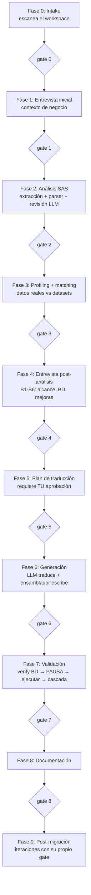

# Cómo funciona sas-migrator v2

Guía completa del sistema: qué toma, qué produce, quién decide qué, y dónde
vive cada regla. Complementa al `README.md` (operación) y a los ADRs
(decisiones de arquitectura).

---

## 1. Qué es

Un migrador de proyectos **SAS Enterprise Guide** (`.egp`) a **Python**
(notebooks pandas + SQL sobre tu base de datos), que produce salidas
**validadas numéricamente** contra los resultados del SAS original.

Tres reglas fundacionales gobiernan todo el diseño:

1. **Los gates son topología, no disciplina.** El pipeline es un grafo
   (LangGraph) donde la fase N+1 solo es alcanzable si el gate N pasó. No es
   una instrucción que alguien puede saltarse: es imposible por construcción.
2. **El LLM nunca escribe artefactos.** Propone contenido estructurado y
   validado (objetos Pydantic); todos los archivos los escribe código
   determinista. Un notebook jamás sale de un modelo directo a disco.
3. **Nunca silencio.** Todo lo que el sistema no puede resolver con certeza
   —un LLM que falla, una tabla que no existe, un libref ambiguo— se declara
   (cola `needs_human`, residuo de extracción, warnings) y bloquea hasta que
   un humano lo resuelva. No hay adivinanzas silenciosas.

---

## 2. Qué toma como entrada

El workspace de una migración:

```
mi_migracion/
├── project_config.yaml    # tu entorno: BD, engines extra, marcadores de auditoría
├── input/
│   ├── egp/proyecto.egp   # OBLIGATORIO: el proyecto SAS EG a migrar
│   ├── data/*.csv         # referencias SAS (ground truth de la validación)
│   └── docs/              # documentación de negocio opcional
├── state/                 # artefactos por fase (los escribe el runtime)
└── output/                # notebooks + run_all.py generados
```

### 2.1 El `.egp` por dentro — qué partes se toman

Un `.egp` es un **ZIP** con estructura conocida. El extractor
(`core/extractors/egp.py`) toma:

| Parte del .egp | Qué contiene | Qué se extrae |
|---|---|---|
| `project.xml` (UTF-16) | Metadata del proyecto: elementos, contenedores, dependencias | El **DAG completo**: qué nodos existen, en qué Process Flow viven, qué alimenta a qué |
| `CodeTask-*/code.sas` | El código SAS que escribieron los analistas | El código de cada nodo — la materia prima de todo |
| `Query-*/` | SQL generado por el query builder de EG | El SQL de las queries visuales (si está materializado) |
| Tareas nativas (ImportTask, asistentes) | Configuración de tareas point-and-click | Se materializan como nodos "sin código" que la entrevista de alcance resuelve |

**Contabilidad del residuo**: cada elemento del `.egp` termina en el DAG **o**
en `state/extraction_residue.json` con su motivo (contenedor, tarea sin
código, query sin payload). Si algo queda sin explicar
(`unexplained_count > 0`), el gate 2 bloquea. El `.egp` nunca se procesa "a
medias" en silencio.

### 2.2 Lo que el parser saca de cada nodo

`core/parser/` (tokenizador con semántica SAS real + parsers dirigidos por
statement) extrae de cada nodo:

- **Inputs/outputs calificados** (`LIB.TABLA`, con `WORK` explícito):
  `SET/MERGE/UPDATE`, `FROM/JOIN`, `CREATE TABLE`, `INSERT/DELETE/UPDATE`,
  `DATA`, `OUT=`, `PROC APPEND`.
- **Librerías declaradas** (`LIBNAME x engine ...`) con su engine — contra la
  lista general de ~30 engines SAS/ACCESS (extensible por config).
- **Referencias macro-dependientes** (`set &tabla`, `TABLAS.BD_&ANIO`): no se
  adivinan — quedan en `macro_refs` y las resuelve la entrevista B4b.
- **Passthrough** (`CONNECT TO ... ; EXECUTE (...) BY ...`): SQL que ya
  corría en la BD.
- **Lecturas/escrituras de archivos** (INFILE, PROC IMPORT/EXPORT, rutas).

Maneja correctamente comentarios `/* */` (incluso sin cerrar), comentarios
`* ;`, strings con comillas, BOM UTF-8, y código malformado (fuzzeado: nunca
crashea, degrada). Validado contra dos `.egp` productivos reales (84 y 175
nodos) con **cero datasets perdidos**.

### 2.3 El clasificador de placement

Con el parse de cada nodo, `core/parser/placement.py` decide **dónde debe
vivir el cómputo**, replicando la localidad que SAS tenía:

| Placement | Significa | Se traduce a |
|---|---|---|
| `sql_passthrough` | Ya corría en la BD (CONNECT TO) | El mismo SQL, casi literal |
| `sql_pushdown` | Lee y escribe BD; el cómputo va en la BD | T-SQL vía `text()` |
| `pandas` | Datos en WORK/archivos | pandas puro |
| `hybrid` | Mezcla BD + local | extract mínimo → pandas → escritura espejo |
| `utility` | Sin datos (macros, fechas, helpers) | Python puro |
| `ambiguous` | No hay certeza (libref sin confirmar, macros) | **Se pregunta** (B4b), jamás se adivina |

Cada decisión lleva evidencia y razones (`nodes_index.json`).

### 2.4 `project_config.yaml` — tu entorno

- `db`: servidor SQL Server (o `connection_url` para otros
  dialectos/pruebas), driver, puerto. **Único** lugar de configuración de BD.
- `parser.extra_db_engines` / `ignore_db_engines`: engines custom del cliente.
- `audit`: marcadores específicos del dominio (APIs de PROC HTTP, manejo de
  secretos, DataFrames a verificar en runtime).

### 2.5 `input/data/` — el ground truth

Los CSV/salidas del SAS original. La fase 3 los perfila y los cruza con los
datasets del DAG; la fase 7 los usa como **referencia numérica**: cada tabla
generada se compara contra su referencia (conteos, sumas, tolerancias). Sin
referencias, la validación queda declarada `not_applicable` — nunca un PASS
fingido.

---

## 3. Las 10 fases y sus gates



| Fase | Quién trabaja | Artefactos clave | El gate bloquea si |
|---|---|---|---|
| 0 Intake | código | `intake.json` | workspace inválido |
| 1 Entrevista inicial | tú + código | `initial_interview.yaml` | requeridas sin responder |
| 2 Análisis | código + LLM | `flow_graph`, `nodes_index`, `lineage`, `code_smells`, `improvements_proposed`, residuo | residuo sin explicar, nodos sin revisar, `needs_human` |
| 3 Profiling | código + LLM | `profile_report`, `file_mapping`, `column_mapping` | archivos sin mapear, `needs_human` |
| 4 Post-análisis | tú + código | `db_connections.yaml`, `api_connections.yaml`, `placement_decisions`, `approved_improvements` | decisiones faltantes, `needs_human` |
| 5 Plan | código + tú | `translation_plan.json` | `user_approved != true` |
| 6 Generación | LLM + ensamblador | notebooks, `run_all.py`, `sas_python_mapping.json` | chequeos estáticos, auditoría high, `needs_human` |
| 7 Validación | código (+LLM si falla) | `table_verification`, `execution_report`, `validation_report` | tabla destino faltante, notebook FAIL, mismatch, `needs_human` |
| 8 Documentación | LLM + código | README de la migración | artefactos faltantes |
| 9 Post-migración | todos | `iteration_log.json` | iteración sin re-validar |

Cada gate valida **existencia + schema JSON + sustancia** (no basta que el
archivo exista: el gate 2 exige cobertura nodo a nodo; el 5, tu aprobación
explícita; el 7, cero FAIL).

---

## 4. Los tres actores — quién decide qué

**Código determinista** (`core/` — sin imports de LLM, frontera vigilada por
test): extracción, parser, placement, gates, ensamblador, ejecución,
validación numérica. Todo lo que debe dar el mismo resultado dos veces.

**El LLM** (`claude-opus-5` vía API Anthropic, con outputs estructurados
Pydantic y prompt caching) participa en exactamente 5 tareas:

| Tarea | Fase | Unidad | Devuelve |
|---|---|---|---|
| Revisión de nodos | 2 | por lote de flujo | propósito + riesgo por nodo |
| Propuestas de mejora | 2 | 1 llamada | fichas M-xxx (tú apruebas/rechazas) |
| Matching | 3 | por lote | archivo ↔ dataset con confianza |
| **Traducción** | 6 | **por nodo** | `NodeTranslation` (celdas, imports, trazabilidad, confianza, warnings) |
| Diagnóstico | 7 | por mismatch (solo si algo falla) | causa raíz entre 8 categorías |
| Documentación | 8 | 1-2 llamadas | README de negocio |

Si el LLM falla validación 3 veces o se rehúsa → el ítem cae a
`state/needs_human.yaml` y el gate bloquea. Cada llamada queda trazada en
`state/llm_trace.jsonl` (task, hash del prompt, outcome, intentos, tokens).

**Tú** decides en los puntos irreversibles o de negocio: contexto inicial,
qué librefs son BD (B4b), cómo migrar cada conexión externa por HTTP (B4c:
replicar con `requests` o usar un SDK oficial que tú nombras), qué mejoras se
aplican (M-xxx), aprobación del plan,
**autorización de ejecución** (default recomendado: NO ejecutar), y las
iteraciones. Toda pregunta llega como tarjeta con default recomendado y
evidencia; "no sé" es respuesta válida.

Una ficha M-xxx que el LLM no puede derivar de la evidencia (una decisión de
arquitectura, p. ej. reemplazar una llamada HTTP cruda por el SDK oficial del
proveedor) se siembra a mano en `state/improvements_seed.yaml`: se valida
contra `Improvement`, se fusiona con las propuestas de la fase 2 y se pregunta
en B5. Sembrar **no** aprueba — la ficha entra siempre como `proposed`.

---

## 5. Los estándares (y dónde vive cada uno)

### 5.1 Notebooks (ensamblador — `core/assembly/notebook.py`)

Estructura idéntica por construcción, un notebook por Process Flow:

```
NB-01_ventas_regionales.ipynb     ← NB-NN codifica el ORDEN TOPOLÓGICO
├── # Título (markdown)
├── Celda 1: Configuración         ← imports consolidados + engine desde env
├── ## Nodo A (markdown, label SAS original)
├── # ========= Nodo A ========= + sus celdas
├── ## Nodo B ...
```

IDs de celda fijos por posición (mismo input ⇒ bytes idénticos). Cada nodo
queda en `sas_python_mapping.json` con notebook, `cell_index` real,
construcción SAS, regla de negocio y confianza.

### 5.2 Conexión a BD

- Config en `project_config.yaml` → conexiones confirmadas por ti en B4b →
  `state/db_connections.yaml` (libref = alias → base/esquema/tablas).
- Un solo constructor de engine (`core/db/engine.py`, SQLAlchemy +
  `mssql+pyodbc` en producción).
- En los notebooks: `engine = sqlalchemy.create_engine(os.environ["SASMIG_DB_URL"])`
  — la URL la inyecta el orquestador al ejecutar. **Jamás credenciales en el
  código** (scanner de secretos lo hace fallo de ensamblado).

### 5.2b Conexiones externas (APIs HTTP)

- Fase 2 lee los hosts del `URL=` literal del propio SAS (`PROC HTTP` /
  `FILENAME ... URL`) → `state/http_evidence.json`. URL armada con macros
  queda declarada (`nodes_with_dynamic_url`), jamás se adivina el host.
- Fase 4, bloque **B4c**: una tarjeta por host — ¿replicar la llamada con
  `requests` (default: mismo host y método que el SAS) o usar una librería
  oficial? (ej.: `bcchapi` para la API BDE del Banco Central). Elegir SDK
  exige nombrar el paquete (nombre de import). Decisión →
  `state/api_connections.yaml`.
- La decisión viaja al prompt de traducción y, si es SDK, el paquete entra a
  la allowlist de imports (y a `requirements.txt` si se usa).
- Auditoría: un host con `mode=sdk` no exige aparecer en el Python (el SDK
  encapsula la URL), pero el paquete ausente en la traducción es un hallazgo
  medium; con `mode=http` la regla de endpoint cambiado sigue siendo high.

### 5.3 Semántica de escritura = espejo del SAS (no se inventa)

| SAS hacía | La traducción hace |
|---|---|
| Reemplazaba (`CREATE TABLE`, `DATA lib.t`) | `DELETE FROM t` sin WHERE + append (conserva DDL/permisos; DROP y `if_exists="replace"` prohibidos) |
| Acumulaba (`PROC APPEND`, `INSERT INTO`) | append tal cual + warning "re-ejecutar duplica, igual que el original" |
| `UPDATE`/`DELETE` | los mismos statements |

Idempotencia por periodo = mejora M-xxx que **tú** apruebas, nunca decisión
del traductor. Vigilado en dos capas: ensamblador (DROP/replace = fallo) y
auditoría (SAS acumula + DELETE inventado = high, bloquea).

### 5.4 Reglas duras del código generado (chequeos estáticos)

Un nodo que viola cualquiera **no se ensambla** y cae a `needs_human`:

- Sintaxis válida; imports resolubles.
- Prohibido `to_parquet`, `duckdb`, `DROP TABLE`, `if_exists="replace"`.
- Prohibido SQL dinámico por f-string (inyección) — `text()` con `:params`.
- Prohibido secretos literales (passwords, API keys, tokens).
- Prohibido rutas absolutas (`C:\...`, `\\servidor\...`, `/ruta/unix`) — el
  estándar es ruta relativa al workspace con `pathlib` + warning del cambio.
- La estrategia del plan se respeta (`strategy_mismatch`).

### 5.5 Estilo de traducción (prompts versionados — `llm/prompts/`)

- `translation_system.md`: contrato del output + reglas duras.
- `patterns_sas_pandas.md`: el idiom canónico por construcción (MERGE con
  `indicator`, FIRST./LAST. con `duplicated`, fechas SAS origen 1960-01-01,
  SUBSTR desde 1, missing `.` como menor-que-todo...).
- `patterns_sas_tsql.md`: SQL que corre en la BD (mapeo LIBREF→BASE.dbo,
  `&macro`→`:param`, CALCULATED→CTE...).

Regla anti-drift: si el LLM se desvía, la respuesta es un **chequeo o patrón
nuevo en git** — nunca "más prompt".

### 5.6 `run_all.py`

Orquestador de entrega, regenerado desde los notebooks existentes (nunca a
mano): los ejecuta en orden topológico vía nbconvert, acepta
`--notebooks NB-03...` para re-validación parcial, advierte que escribe en la
BD, exit 1 si algo falla. Hace el output autónomo: operable sin el migrador.

---

## 6. Validación (fase 7) — el corazón de la confianza

1. **verify_tables**: el sistema **nunca crea tablas**. Inspecciona la BD:
   tabla DESTINO faltante ⇒ bloquea (la crea tu DBA); fuente faltante ⇒ se
   reporta; sin acceso ⇒ pendiente declarado.
2. **Referencias staged**: los CSV de `input/data` se preparan para comparar.
3. **La pausa sagrada**: tarjeta `execution_approval` con default **NO
   ejecutar**. Nada corre contra tu BD sin tu sí explícito.
4. **Ejecución** (nbclient): cada notebook corre de verdad; FAIL bloquea.
5. **Cascada de validación**: cada tabla generada vs su referencia SAS —
   conteos, valores, tolerancias configurables. PASS/WARN/FAIL por tabla.
6. **Diagnóstico LLM** (solo si hay mismatch): causa raíz entre 8 categorías
   (encoding, redondeo, semántica de nulos, collation, orden, coerción de
   tipos, transformación faltante, desconocida) con evidencia.

## 7. Post-migración (fase 9)

`sas-migrator iterate "petición" -n <node_id>`: cada iteración es un
sub-grafo con su propio gate — clasifica la petición, pregunta contexto si
falta, re-traduce **solo** los nodos afectados, re-ensambla, re-valida, y
registra todo en `iteration_log.json`. El gate 9 impide cerrar una iteración
sin re-validación.

---

## 8. Cómo se usa

```bash
# La puerta de entrada de todo .egp nuevo (segundos, sin costo, sin riesgo):
SASMIG_REAL_EGP=C:/ruta/proyecto.egp pytest tests/integration -q
#   → nodos, flujos, residuo, nodos macro-dependientes → backlog JSON

# Preflight: estructura, config, credencial y extras (sin red, sin costo):
sas-migrator doctor -w D:\Migraciones\mi_proyecto

# Migración real (entrevistas + LLM + pausa antes de tocar la BD) — el default:
sas-migrator run -w D:\Migraciones\mi_proyecto
# (`--stub` es el modo determinista sin LLM ni entrevistas, para CI)

# Estado / reanudar (checkpointer sqlite, sobrevive cortes):
sas-migrator status -w D:\Migraciones\mi_proyecto
sas-migrator resume -w D:\Migraciones\mi_proyecto

# Rehacer una fase desde cero (resume la continúa, rewind la reinicia):
sas-migrator rewind -p 6 -w D:\Migraciones\mi_proyecto

# Conducirlo desde un chat (Claude Desktop, VS Code/Copilot — cualquier host MCP):
sas-migrator serve -w D:\Migraciones\mi_proyecto
```

Los tres frentes —CLI, MCP y `MigrationSession` en Python— son el mismo camino
de ejecución: elegir frente cambia cómo se contestan las entrevistas, no qué
corre. El README tiene la referencia completa de los tres.

Requisitos para la corrida real: `ANTHROPIC_API_KEY` (o Claude vía Azure AI
Foundry del trabajo), `db.default_server` en la config, y referencias en
`input/data/`. Costo típico: decenas de USD por migración (1 llamada de
traducción por nodo + análisis; system prompt cacheado).

---

## 9. Mapa de archivos del repo

```
src/sas_migrator/
├── core/                  # determinista puro (frontera vigilada por test)
│   ├── extractors/egp.py  #   .egp → FlowGraph + residuo
│   ├── parser/            #   tokenizador, statements, placement, enrich
│   ├── assembly/          #   ensamblador de notebooks + chequeos estáticos
│   ├── db/                #   engine único, verify_tables, profile
│   ├── validation/        #   cascada numérica, referencias
│   ├── interview/         #   tarjetas B1-B6, apply, validate
│   ├── audit.py           #   auditoría semántica (gate 6)
│   ├── planning.py        #   plan de traducción
│   └── utils/             #   gates (schema_validation), needs_human
├── graph/                 # LangGraph: fases, gates, interrupts, iteración
├── llm/                   # cliente Anthropic, contratos, prompts/, trace
├── service/ + mcp_server/ # sesión compartida CLI/MCP, 7 tools
└── cli/                   # run/resume/status/serve/iterate

tests/  unit (313) · golden (determinismo/UX) · evals (12 casos) ·
        integration (harness .egp real) · adversarial
docs/   adr/0001-0008 · este documento
```

---

## 10. Resumen en una frase

Tomas un `.egp`, el sistema extrae **todo** (y declara lo que no pudo), te
pregunta **solo** lo que no puede saber, traduce nodo a nodo bajo un estándar
escrito y vigilado por código, no ejecuta **nada** contra tu BD sin tu
autorización, valida los números contra el SAS original, y te deja notebooks
trazables + un orquestador + documentación — con cada decisión (tuya, del
código o del LLM) registrada en un artefacto auditable.
